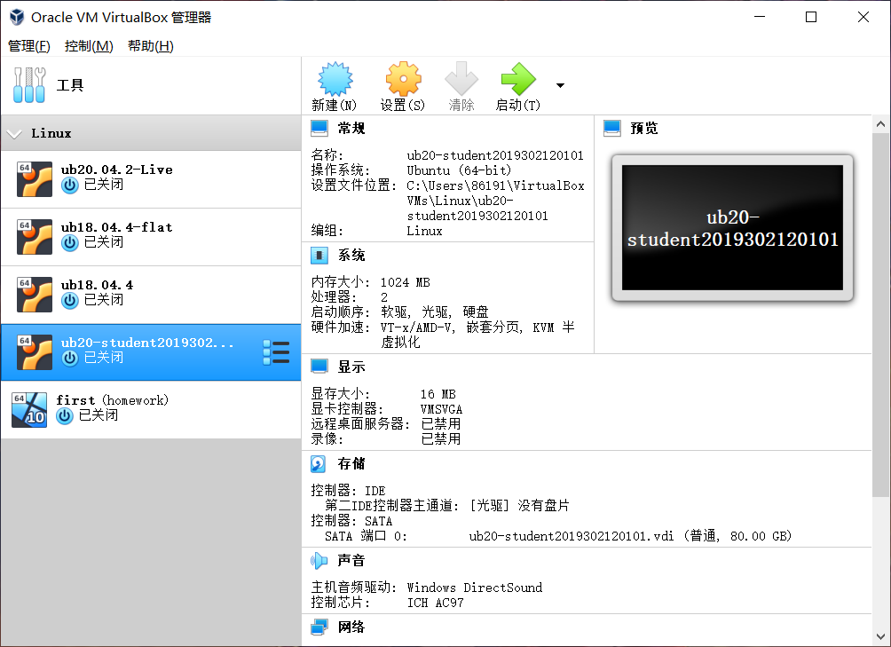
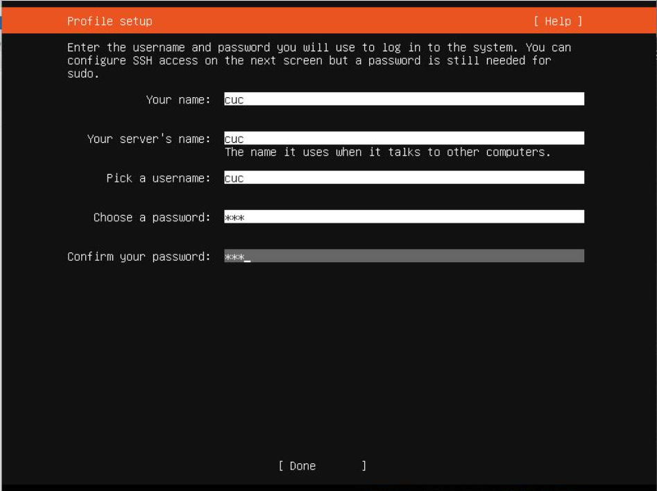
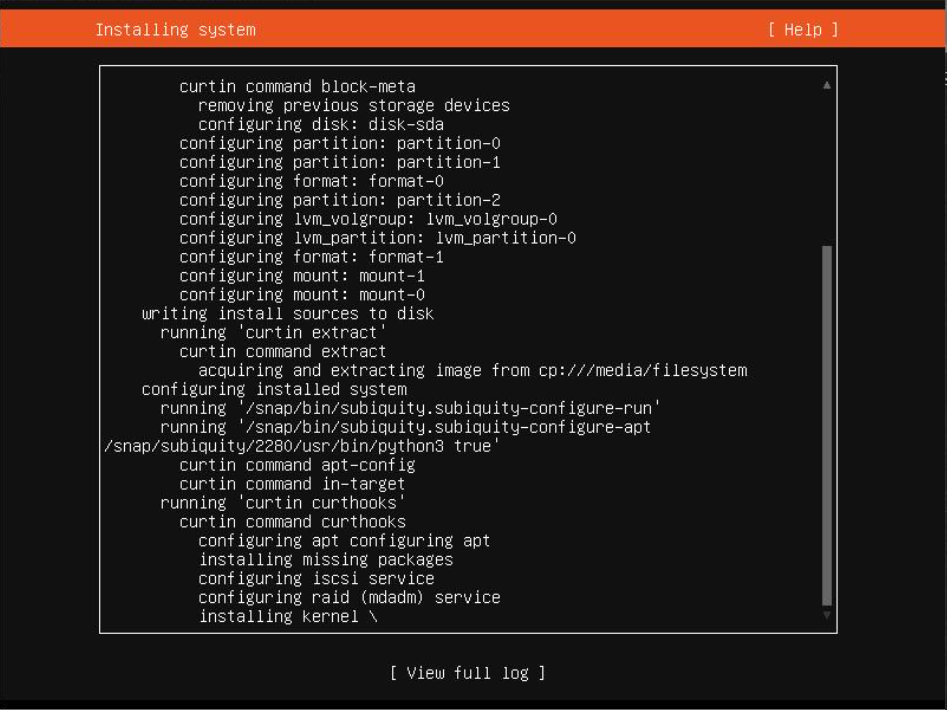
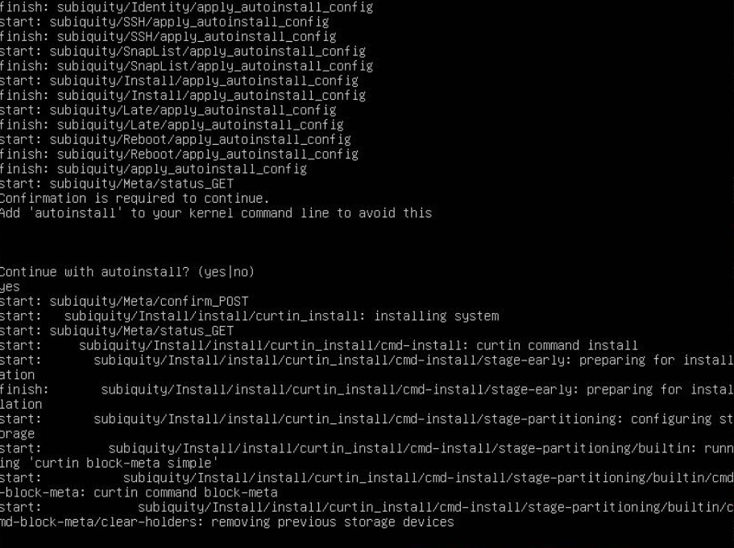

# 第一次实验报告

## 实验目的：
实现无人值守的Linux安装镜像的操作
***
## 实验步骤：

1.在官网（https://releases.ubuntu.com/focal/ ）上下载Unbuntu安装镜像iso文件

2.先在virtualbox上手动安装镜像文件

3.安装完成后，启动镜像文件，并进行手动安装

***

4.安装完成后，在SATA里先后挂载Ubuntu 20.04和init.iso，设置网卡。

5.进行无人值守安装，

***
## 参考目录
1.https://www.yuque.com/c4pr1c3/linux/ttkz7y

2.https://space.bilibili.com/388851616?from=search&seid=1805603904240208432

3.https://github.com/CUCCS
***
## 遇到的问题
1.Windows系统周六更新后，与virtualbox不兼容，导致原本的虚拟机打开时报错。